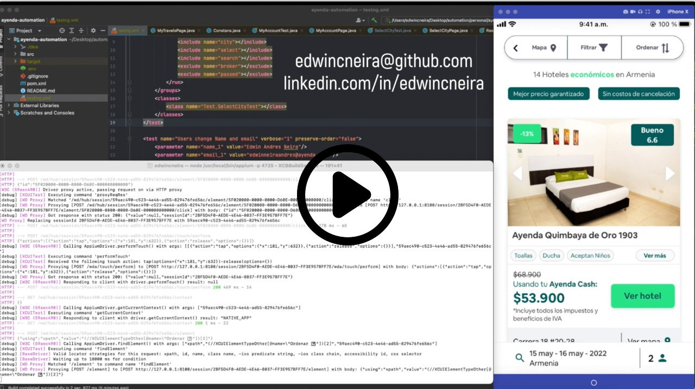

# Ayenda Automation for iOS 📱🍎

## Tools 💻🛠

---

> Appium, TestNG, Java. Design with structure POM (Page Object Model)

---

[App Apple Store](https://apps.apple.com/co/app/ayenda-hoteles-econ%C3%B3micos/id1492945311)

---

---

## Iniciar el proyecto

---
#### ***Iniciar el servidor local de Appium***

`$ appium -p 4725`

---
#### ***En el archivo de Java `src/test/java/Test/Base.java` ingresar los datos de tu dispositivo***

---
#### ***Ahora puedes ejecutar el archivo testng.xml que se encuentra en la raíz del proyecto*** ✌ 

# Dudas

Si tienes una duda acerca del código puedes hacer la pregunta al siguiente correo ***eachivatan@correo.udistrital.edu.co*** con el asunto 
***Duda Automatización*** 💪
